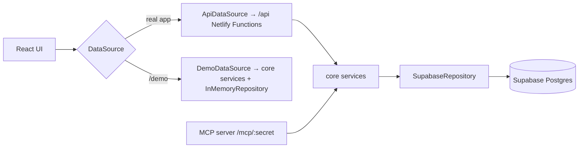

# Architecture

> Skeleton — filled in as milestones land. The full design is in [SPEC §B12](SPEC.md#b12-architecture-and-code-organisation).

## Overview

- The browser never talks to Supabase directly.
- Business logic lives only in `src/core` and is shared by the API, the MCP server, and demo mode.

## Folders

| Folder                | Purpose                                                                             |
| --------------------- | ----------------------------------------------------------------------------------- |
| `src/app`             | Routing, layout, providers, auth guard                                              |
| `src/features`        | One folder per screen area                                                          |
| `src/components`      | Shared UI (`components/ui` = shadcn/ui)                                             |
| `src/data`            | `DataSource` interface and implementations                                          |
| `src/core`            | Isomorphic domain types, Zod schemas, pure logic, services, repositories, demo data |
| `netlify/functions`   | Thin API handlers and the MCP server                                                |
| `supabase/migrations` | Numbered SQL migrations                                                             |
| `e2e`                 | Playwright tests (run against `/demo`)                                              |

## Environments

| Branch           | Netlify         | Database      |
| ---------------- | --------------- | ------------- |
| Feature branches | Deploy previews | Supabase dev  |
| `develop`        | Branch deploy   | Supabase dev  |
| `main`           | Production      | Supabase prod |

## Decisions

See the decision log in [SPEC §B15](SPEC.md#b15-decision-log) and [PROGRESS.md](PROGRESS.md).
