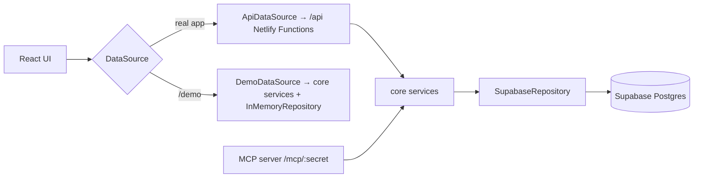

# Architecture

> Skeleton — filled in as milestones land. The full design is in [SPEC §B12](SPEC.md#b12-architecture-and-code-organisation).

## Overview

- The browser never talks to Supabase directly.
- Business logic lives only in `src/core` and is shared by the API, the MCP server, and demo mode.

## Folders

| Folder                | Purpose                                                                             |
| --------------------- | ----------------------------------------------------------------------------------- |
| `src/app`             | Routing, layout, providers, auth guard                                              |
| `src/features`        | One folder per screen area                                                          |
| `src/components`      | Shared UI (`components/ui` = shadcn/ui)                                             |
| `src/data`            | `DataSource` interface and implementations                                          |
| `src/core`            | Isomorphic domain types, Zod schemas, pure logic, services, repositories, demo data |
| `netlify/functions`   | Thin API handlers and the MCP server (every top-level file is deployed)             |
| `netlify/tests`       | Tests for the functions (kept out of `netlify/functions` so they aren't deployed)   |
| `supabase/migrations` | Numbered SQL migrations                                                             |
| `e2e`                 | Playwright tests (run against `/demo`)                                              |

## Validation

Every service validates its own input with the Zod schemas in `src/core/schemas/inputs.ts`
(`parseInput`), so the API, MCP, and demo mode enforce the same rules. API handlers also validate
the request body first, which turns bad JSON into a 400 before any service runs. Repositories are
the last line of defence: the database (and `InMemoryRepository`, which mirrors it) rejects
duplicate sibling names, a fourth level, and deleting nodes that have history.

## Dashboard

`getDashboard` reads the tree, settings, deadlines, and a light list of every session
(`node, date, minutes`) once, then computes everything with the pure functions in `src/core/logic`
(roll-ups, streaks, neglect, syllabus %, heatmap). Supabase returns at most 1000 rows per request,
so `SupabaseRepository.listSessionFacts` reads in pages. For one person's history this stays small;
if it ever grows too large, a Postgres view or RPC can pre-aggregate it.

## API endpoints

All require a session cookie except `auth/login`, `auth/signup`, `auth/passcode`, `auth/forgot`,
`auth/resend`, `auth/logout`, `health`, and `keepalive`. Every data endpoint reads and writes only the
logged-in user's rows (`deps.repo` is a per-user repository; see Accounts below).

| Endpoint                 | Methods       | Purpose                                                   |
| ------------------------ | ------------- | --------------------------------------------------------- |
| `/api/auth/signup`       | POST          | Create an account (Supabase Auth), limited per IP         |
| `/api/auth/login`        | POST          | Email + password login (lockout), first-login seed, claim |
| `/api/auth/passcode`     | POST          | Old passcode → claim cookie (ACCT-7)                      |
| `/api/auth/forgot`       | POST          | Email a reset link (same answer for unknown emails)       |
| `/api/auth/resend`       | POST          | Send the confirmation email again                         |
| `/api/auth/password`     | POST          | Change password; logs out other devices                   |
| `/api/auth/account`      | DELETE        | Delete the account and all its data                       |
| `/api/auth/logout`       | POST          | Clear the session cookie                                  |
| `/api/auth/me`           | GET           | Who is logged in (email, name), reset-link state          |
| `/auth/confirm`          | GET           | Where email links land; logs in, then redirects           |
| `/api/nodes`             | GET, POST     | The structure tree; add a node                            |
| `/api/nodes/:id`         | PATCH, DELETE | Rename, recolor, archive/restore; delete                  |
| `/api/nodes/:id/move`    | POST          | Move up/down among siblings                               |
| `/api/sessions`          | GET, POST     | A 30-day History page (filters); log a session            |
| `/api/sessions/:id`      | PATCH, DELETE | Edit or delete a session                                  |
| `/api/recent-nodes`      | GET           | The 5 most recently used nodes                            |
| `/api/dashboard`         | GET           | Everything Home shows, in one request (DASH-1)            |
| `/api/deadlines`         | GET, POST     | List and add deadlines                                    |
| `/api/deadlines/:id`     | PATCH, DELETE | Edit or delete a deadline                                 |
| `/api/settings`          | GET, PATCH    | Student name, neglect threshold                           |
| `/api/claude-connection` | GET, POST     | Whether a link exists; POST makes a new one (shown once)  |
| `/api/health`            | GET           | Liveness, no database                                     |
| `/api/keepalive`         | GET           | One trivial database read                                 |

## Accounts (M5A, SPEC D17)

- **Supabase Auth** holds accounts and passwords and sends the confirmation and reset emails
  (through Brevo SMTP). Only the server calls it (`_lib/authProvider.ts`, a fresh client per call
  with the secret key), so the browser still never talks to Supabase.
- **Sessions** are our own cookie `sw_session` = `<userId>.<issuedAt>.<expiry>.<HMAC>` (30 days,
  Strict). Supabase Auth checks the password only at login, so ordinary requests don't call it. A
  password change sets `user_settings.sessions_valid_after`; cookies issued earlier are refused
  (cached for up to 60 s per warm function instance).
- **Email links** use the token-hash flow: the templates in `docs/email-templates/` link to
  `<site>/auth/confirm?token_hash=…&type=signup|recovery`, which verifies the token on the server,
  logs the user in, and redirects (a reset link also sets the short-lived `sw_recovery` cookie).
- **Per-user data:** `user_id` on every table (migration `0003`) with same-owner composite foreign
  keys, so the database itself refuses a row that points at another user's row.
  `SupabaseRepository` is built per user and filters every query by `user_id`; RPCs take
  `p_user_id`. Core services didn't change: they receive the user's repository.
- **Claiming old data (ACCT-7):** rows from before accounts have `user_id` null. Entering the old
  `APP_PASSCODE` sets `sw_claim` (Lax, 24 h); the next login or confirmation in that browser runs
  `claim_unclaimed_data` atomically. Migration `0004` (after release R3) will drop the leftovers.

## Claude connection (MCP)

`POST /mcp/<token>` (`netlify/functions/mcp.ts`) is a stateless Streamable HTTP server built
with the official SDK v2 (`@modelcontextprotocol/server`, `createMcpHandler`). It answers both the
2025 protocol and 2026-07-28 from one endpoint, building a fresh `McpServer` per request.

- **Auth:** each user's random token in the URL is the only credential (ACCT-8). Only its SHA-256
  hash is stored (`user_settings.mcp_token_hash`); the server looks the user up by hash and serves
  only that user's data. Anything else gets a plain 404. Only POST is accepted (a serverless
  function can't hold the GET event stream open).
- **Tools** (`netlify/functions/_lib/mcp/server.ts`) are thin wrappers: resolve node and date
  references (`src/core/logic/nodeRef.ts`, `dateRef.ts`), call a core service, return compact JSON
  text. Input schemas live in `src/core/schemas/mcp.ts`. Domain errors come back as
  `isError` results with `{ error: { code, message } }`, so Claude can correct itself.
- Every tool call stamps the user's `last_mcp_call_at`, shown in Settings → Claude connection.
- Check it with MCP Inspector:
  `npx @modelcontextprotocol/inspector --cli <url> --transport http --method tools/list`.

## Environments

One Supabase project serves every environment (SPEC D15).

| Branch           | Netlify         | Database                |
| ---------------- | --------------- | ----------------------- |
| Feature branches | Deploy previews | Supabase (shared, real) |
| `develop`        | Branch deploy   | Supabase (shared, real) |
| `main`           | Production      | Supabase (shared, real) |

## Decisions

See the decision log in [SPEC §B15](SPEC.md#b15-decision-log) and [PROGRESS.md](PROGRESS.md).
