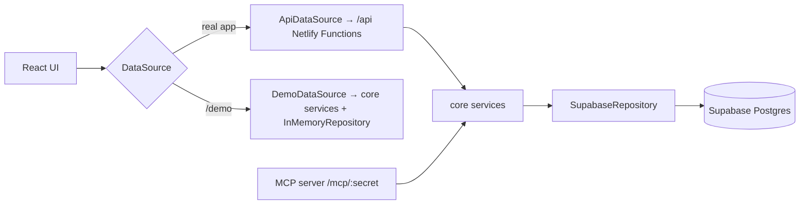

# Architecture

> Skeleton — filled in as milestones land. The full design is in [SPEC §B12](SPEC.md#b12-architecture-and-code-organisation).

## Overview

- The browser never talks to Supabase directly.
- Business logic lives only in `src/core` and is shared by the API, the MCP server, and demo mode.

## Folders

| Folder                | Purpose                                                                             |
| --------------------- | ----------------------------------------------------------------------------------- |
| `src/app`             | Routing, layout, providers, auth guard                                              |
| `src/features`        | One folder per screen area                                                          |
| `src/components`      | Shared UI (`components/ui` = shadcn/ui)                                             |
| `src/data`            | `DataSource` interface and implementations                                          |
| `src/core`            | Isomorphic domain types, Zod schemas, pure logic, services, repositories, demo data |
| `netlify/functions`   | Thin API handlers and the MCP server (every top-level file is deployed)             |
| `netlify/tests`       | Tests for the functions (kept out of `netlify/functions` so they aren't deployed)   |
| `supabase/migrations` | Numbered SQL migrations                                                             |
| `e2e`                 | Playwright tests (run against `/demo`)                                              |

## Validation

Every service validates its own input with the Zod schemas in `src/core/schemas/inputs.ts`
(`parseInput`), so the API, MCP, and demo mode enforce the same rules. API handlers also validate
the request body first, which turns bad JSON into a 400 before any service runs. Repositories are
the last line of defence: the database (and `InMemoryRepository`, which mirrors it) rejects
duplicate sibling names, a fourth level, and deleting nodes that have history.

## Dashboard

`getDashboard` reads the tree, settings, deadlines, and a light list of every session
(`node, date, minutes`) once, then computes everything with the pure functions in `src/core/logic`
(roll-ups, streaks, neglect, syllabus %, heatmap). Supabase returns at most 1000 rows per request,
so `SupabaseRepository.listSessionFacts` reads in pages. For one person's history this stays small;
if it ever grows too large, a Postgres view or RPC can pre-aggregate it.

## API endpoints

All require a session cookie except `auth/login`, `health`, and `keepalive`.

| Endpoint              | Methods       | Purpose                                         |
| --------------------- | ------------- | ----------------------------------------------- |
| `/api/auth/login`     | POST          | Passcode login (rate-limited), first-login seed |
| `/api/auth/logout`    | POST          | Clear the session cookie                        |
| `/api/auth/me`        | GET           | Is this browser logged in?                      |
| `/api/nodes`          | GET, POST     | The structure tree; add a node                  |
| `/api/nodes/:id`      | PATCH, DELETE | Rename, recolor, archive/restore; delete        |
| `/api/nodes/:id/move` | POST          | Move up/down among siblings                     |
| `/api/sessions`       | GET, POST     | A 30-day History page (filters); log a session  |
| `/api/sessions/:id`   | PATCH, DELETE | Edit or delete a session                        |
| `/api/recent-nodes`   | GET           | The 5 most recently used nodes                  |
| `/api/dashboard`      | GET           | Everything Home shows, in one request (DASH-1)  |
| `/api/deadlines`      | GET, POST     | List and add deadlines                          |
| `/api/deadlines/:id`  | PATCH, DELETE | Edit or delete a deadline                       |
| `/api/settings`       | GET, PATCH    | Student name, neglect threshold                 |
| `/api/health`         | GET           | Liveness, no database                           |
| `/api/keepalive`      | GET           | One trivial database read                       |

## Environments

One Supabase project serves every environment (SPEC D15).

| Branch           | Netlify         | Database                |
| ---------------- | --------------- | ----------------------- |
| Feature branches | Deploy previews | Supabase (shared, real) |
| `develop`        | Branch deploy   | Supabase (shared, real) |
| `main`           | Production      | Supabase (shared, real) |

## Decisions

See the decision log in [SPEC §B15](SPEC.md#b15-decision-log) and [PROGRESS.md](PROGRESS.md).
